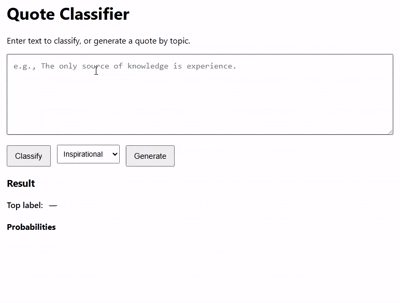
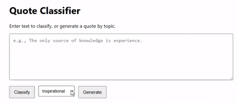

# Quote Classification & Generation System

An end-to-end **Machine Learning system** for large-scale quote ingestion, **topic classification**, and **text generation**.

---

## Business Problem

Modern organizations deal with **large volumes of unstructured text content**, such as quotes, short messages, marketing copy, notifications, or user-generated text. Two recurring challenges arise:

1. **Content Classification at Scale**  
   Text needs to be reliably categorized to enable:
   - content routing
   - personalization
   - analytics
   - downstream automation

   Manual labeling does not scale, while uncontrolled NLP models introduce inconsistency and risk.

2. **Controlled Text Generation**  
   Businesses increasingly want to **generate short-form text automatically**, but:
   - generic language models lack topic control
   - outputs are hard to validate
   - off-topic or low-quality text creates brand and product risk

This project addresses both problems by combining **deterministic data ingestion**, **supervised classification**, and **validated text generation** into a single, production-oriented ML system.

---

## Examples




---

## System Architecture

```
                                        ┌───────────────────────────┐
                                        │   Quote Sources           │
                                        │  (AZQuotes, Goodreads,    │
                                        │   FamousQuotes)           │
                                        └─────────────┬─────────────┘
                                                      │
                                                      ▼
                                        ┌──────────────────────────┐
                                        │  Go Scrapers (CLI)       │
                                        │  - Concurrency           │
                                        │  - Retry + Backoff       │
                                        │  - Deterministic IDs     │
                                        └───────────┬──────────────┘
                                                    │
                                                    ▼
                                        ┌─────────────────────────┐
                                        │   JSONL Dataset         │
                                        │   (QuoteRecord schema)  │
                                        └───────────┬─────────────┘
                                                    │
                            ┌───────────────────────┴───────────────────────────┐
                            │                                                   │
                            ▼                                                   ▼
                ┌──────────────────────────────┐                 ┌───────────────────────────────┐
                │ BERT Classifier Training     │                 │ T5 Generator Training         │
                │ - Topic classification       │                 │ - Topic-conditioned generation│
                │ - Class imbalance handling   │                 │ - Teacher forcing             │
                │ - Macro-F1 evaluation        │                 │ - Cross-entropy loss          │
                └─────────────┬────────────────┘                 └─────────────┬─────────────────┘
                              │                                                │
                              ▼                                                ▼
                    ┌─────────────────────┐                      ┌─────────────────────────┐
                    │  Classifier Model   │                      │  Generator Model        │
                    │  (BERT)             │                      │  (T5-base)              │
                    └───────────┬─────────┘                      └─────────────┬───────────┘
                                │                                              │
                                └──────────────┬───────────────────────────────┘
                                               ▼
                                ┌───────────────────────────────────────┐
                                │        ML Service (FastAPI)           │
                                │  - /classify                          │
                                │  - /generate                          │
                                │  - Generation + validation loop       │
                                └──────────────┬────────────────────────┘
                                               │
                                               ▼
                                ┌─────────────────────────────────┐
                                │   Go API Gateway + UI           │
                                │   - HTTP proxy                  │
                                │   - Topic selection             │
                                │   - Generation & classification │
                                └─────────────────────────────────┘
```

---

## Repository Structure

```
.
├── go/
│   ├── internal/
│   │   └── scraper/
│   └── cmd/
│       ├── quotes-go/
│       └── quotes-api/
│
├── ml_service/
│   ├── app.py
│   ├── generator.py
|   ├── train_bert.py
|   ├── train_t5_generator.py
│   └── models/
│
│
├── python/
│   └── ...
│
└── README.md
```

---

## Data Ingestion (Go Scrapers)

### Build
```
go build -o quotes-go ./go/cmd/quotes-go
```

### Run
```
./quotes-go --site azquotes --topics inspirational,love,life --start 1 --end 5 --workers 8 --out data/quotes.jsonl
```

---

## ML Training

### Classification
```
python ml_training/train_bert.py
```

### Generation
```
python ml_training/train_t5_generator.py
```

---

## ML Service

```
cd ml_service
uvicorn app:app --host 0.0.0.0 --port 8000
```

Users must provide trained models under `ml_service/models/classifier` and `ml_service/models/generator`.

---

## Go Gateway

```
go run ./go/cmd/quotes-api
```
and open

```
http://localhost:8080
```

---

## Running with Docker

`docker-compose up --build`

Open the UI in your browser

`http://localhost:8080`